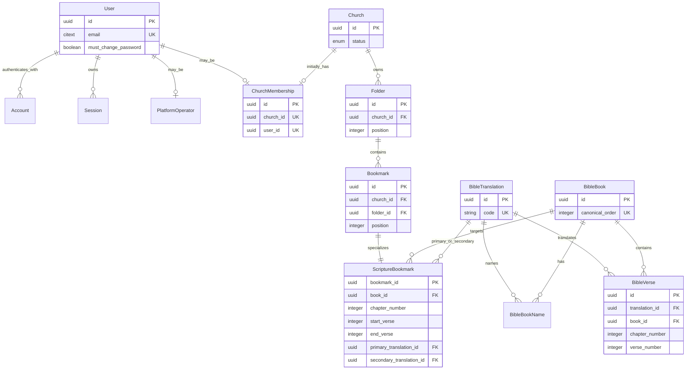

# ADR 0007: Use normalized ownership-specific relational models

- Status: accepted
- Date: 2026-08-21
- Decision owners: product owner and architecture maintainers
- Supersedes: none
- Superseded by: none

## Context

Legacy Ginmaku stores Bible locations through loose integer references and
bookmarks through controller/action names plus opaque route-parameter JSON. Its
schema has no declared foreign keys or uniqueness constraints. Levi must instead
support multiple churches, Better Auth identities, a shared bilingual Bible
catalog, and church-owned folders/bookmarks while preventing invalid state in
PostgreSQL itself.

ADR 0006 selects Better Auth with revocable database sessions. Better Auth owns
its User, Account, Session, and Verification storage contract; Levi owns actor
classification, church membership, tenant authorization, forced-password-change
state, shared scripture masters, and prepared church content.

The initial product permits one church user per church, but later multiple users
must not require replacing identities or re-owning church content. Slides are
mandatory later work but are not part of the initial schema.

## Decision

Use normalized, ownership-specific PostgreSQL tables mapped explicitly in
Prisma. Every durable record uses a UUID primary key and UTC `timestamptz`.
Foreign keys are restrictive by default; cascading deletion is limited to a
named aggregate boundary.

The complete physical contract, including columns, named constraints, indexes,
deletion rules, representative queries, and implementation sequencing, is in
[`data-model-dictionary.md`](data-model-dictionary.md). That dictionary is part
of this decision.

### Identity and actor boundaries

- Preserve Better Auth's four core Prisma models and logical fields: `User`,
  `Account`, `Session`, and `Verification`. Map physical tables/columns with
  Prisma `@@map`/`@map`; do not rename the adapter-facing models.
- Configure `advanced.database.generateId: "uuid"` so Better Auth and its
  PostgreSQL schema agree on UUID IDs for every core model.
- Store normalized email as PostgreSQL `citext`, enforce global uniqueness, and
  add a CHECK requiring the stored form to equal `lower(btrim(email::text))`.
- Extend `User` with server-owned `mustChangePassword`. Better Auth input cannot
  set it and public responses do not return it.
- Initial `Account` rows are credential-only. A named CHECK requires provider
  `credential`, a password hash, and null OAuth token fields. Enabling OAuth
  requires a new migration and ADR review rather than silently relaxing the
  constraint.
- A `PlatformOperator` and a `ChurchMembership` are explicit subtype tables.
  A deferred PostgreSQL constraint trigger locks the User row and rejects a User
  present in both tables, including concurrent transactions.
- A valid Better Auth session never implies platform or church authorization.
  Server use cases resolve exactly one actor subtype and, for church users, the
  membership's Church.

### Tenancy

- `Church` is the tenant and carries the active/suspended lifecycle state.
- `ChurchMembership` links identity to tenant. Unique `user_id` and unique
  `church_id` enforce the initial one-user/one-church rule.
- To allow multiple church users later, drop only the unique constraint on
  `church_id`; identity, membership, and all church-owned rows remain unchanged.
- `Folder` owns `Bookmark`; both carry `church_id`. A composite foreign key from
  Bookmark `(folder_id, church_id)` to Folder `(id, church_id)` prevents a
  bookmark from claiming a different tenant than its folder.
- Every church-owned repository method requires a server-derived `church_id` and
  includes it in the SQL predicate. Entity UUID alone is never sufficient.

### Bible catalog and typed bookmarks

- `BibleTranslation` identifies JSS3 and KJV through stable codes and carries a
  rights/provenance gate. A translation is not inferred from language or legacy
  version text, and Bible text cannot be imported or displayed while its status
  is pending approval.
- `BibleBook` provides one canonical book identity and order shared by every
  translation plus an Old/New Testament classification. `BibleBookName` stores
  a translation-specific displayed name.
- `BibleVerse` is unique by translation, book, chapter, and verse. Chapter and
  verse numbers are positive; navigation uses canonical book order and existing
  locations, never row UUID or insertion order.
- Verse text is non-null. A nonblank CHECK is not added until approved dump
  profiling in Issue #47 proves that the source contains no meaningful empty
  value or defines an explicit repair policy. This is a compatibility gate, not
  permission to display or silently accept missing scripture.
- `Bookmark` stores common title/order/ownership only. Its required one-to-one
  `ScriptureBookmark` stores canonical book, chapter, inclusive range, primary
  translation, and optional secondary translation. It never stores route JSON.
- Composite foreign keys from each selected translation and both range endpoints
  to `BibleVerse` prove that the selected start/end locations exist. A CHECK
  requires positive numbers, `end_verse >= start_verse`, and distinct primary
  and secondary translations.

### Ordering and concurrency

- Folder position is unique within Church; Bookmark position is unique within
  Folder. Positions are zero-based non-negative integers.
- Implement both unique constraints as `DEFERRABLE INITIALLY IMMEDIATE` in raw
  migration SQL. Prisma cannot express deferrability.
- Reorder transactions lock the owner row (`Church` or `Folder`), defer the
  position constraint, rewrite the complete ordered set to contiguous positions,
  and commit. The owner lock serializes concurrent reorders and create/delete
  compaction without relying on last-write-wins behavior.
- Pinned folders display first by position. Remaining folders display by
  `last_used_at DESC NULLS LAST`, then position and UUID, capped at 20 total.
  `last_used_at` changes only on explicit folder selection or bookmark reopen.

### Physical features beyond Prisma schema

Use reviewed migration SQL for:

- `CREATE EXTENSION IF NOT EXISTS citext` and `@db.Citext` email mapping;
- named CHECK constraints and the actor-exclusivity constraint trigger;
- deferrable unique position constraints;
- `DESC NULLS LAST` and cleanup indexes where Prisma's schema representation is
  insufficient; and
- composite endpoint foreign keys that overlap the typed bookmark location
  scalars.

Generated Better Auth or Prisma SQL is review input only. Repository migrations
remain immutable and are the only schema deployment artifact.

## Entity relationships

`PlatformOperator` and `ChurchMembership` are mutually exclusive for one User;
the ER cardinalities do not by themselves express that cross-table invariant.

## Consequences

### Positive

- PostgreSQL rejects duplicate identities, cross-tenant ownership, reversed
  ranges, nonexistent endpoints, duplicate positions, and invalid actor mixing.
- Shared Bible masters are independent of churches and cannot be deleted by
  deleting prepared church content.
- Future multiple church users require removing one cardinality constraint, not
  replacing identity or content ownership.
- Future Slides can use a dedicated aggregate without weakening current types.

### Negative and risks

- Some critical constraints require hand-written PostgreSQL SQL and focused
  integration tests because Prisma cannot express them completely.
- Redundant Bookmark `church_id` increases write responsibility, though the
  composite foreign key prevents drift and enables direct tenant-scoped queries.
- Better Auth upgrades require comparing its generated schema contract against
  explicit mappings and constraints.
- A nonblank Bible-text decision remains gated on approved dump profiling.

## Alternatives considered

### Reproduce legacy tables and route-parameter JSON

Rejected because controller names and route parameters are not stable domain
types and cannot provide relational range or tenant integrity.

### Generic polymorphic saved-item table

Rejected because the initial release has one known bookmark type. Generic type
and JSON payload columns would move referential and validation rules out of the
database and complicate the mandatory later Slide aggregate.

### Put tenant and role directly on Better Auth User

Rejected because identity is not a tenant or authorization decision. Explicit
membership and operator subtypes allow future cardinality changes and deny users
without a valid actor assignment.

### Application-only email and ordering checks

Rejected because concurrent requests could create case-variant duplicate email
or duplicate positions. Database uniqueness and serialized reorder transactions
are required.

## Migration and compatibility policy

- Issue #42 adds Better Auth and tenancy tables without applying generated
  schema directly.
- Issue #46 adds shared Bible catalog tables.
- Issue #47 profiles the approved dump and decides the nonblank text constraint.
- Issue #54 adds Folder, Bookmark, and ScriptureBookmark after Bible keys exist.
- Each phase uses expand, deterministic backfill/import, reconciliation, then
  contract. Destructive contract steps require an empty-invalid-row proof and a
  rehearsed forward migration.
- Production application or migration remains outside these Issues and requires
  explicit human approval immediately before execution.

## Reconsider when

- Multiple church users, a user belonging to multiple churches, OAuth, or a new
  actor type becomes approved scope.
- Better Auth no longer supports mapped core model/field names or requires a
  conflicting schema contract.
- Dump profiling proves that empty verse text has defined meaning requiring a
  separate state rather than a nonblank constraint.
- Measured query plans require partitioning or a different scripture storage
  strategy.

## Verification

- Migration integration tests inspect every named constraint/index and exercise
  both allowed and rejected writes from the dictionary matrix.
- Tenant tests attempt cross-church Folder/Bookmark reads and writes using valid
  UUIDs from another church.
- Auth tests exercise actor exclusivity, email case variants, credential field
  isolation, session revocation/expiry, and delete scope.
- Bible tests exercise duplicate locations, invalid numbers, endpoint foreign
  keys, bilingual translation mismatch, and boundary-order queries.
- Reorder tests run concurrent transactions and prove one deterministic result
  with no duplicate position.

## References

- [Better Auth database core schema](https://better-auth.com/docs/concepts/database)
- [Better Auth Prisma adapter](https://better-auth.com/docs/adapters/prisma)
- [Better Auth session management](https://better-auth.com/docs/concepts/session-management)
- [Prisma PostgreSQL extensions](https://www.prisma.io/docs/orm/prisma-schema/postgresql-extensions)
- [Prisma PostgreSQL native types](https://docs.prisma.io/docs/orm/overview/databases/postgresql)
- [Prisma indexes](https://docs.prisma.io/docs/orm/prisma-schema/data-model/indexes)
- [Prisma CHECK constraints](https://www.prisma.io/docs/orm/more/troubleshooting/check-constraints)
- [PostgreSQL constraints](https://www.postgresql.org/docs/current/ddl-constraints.html)
